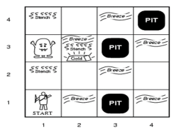
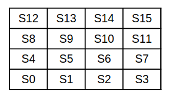
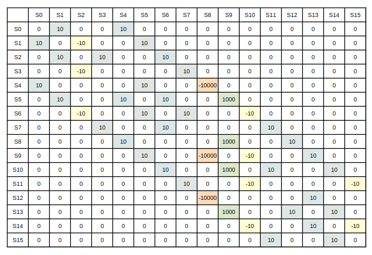
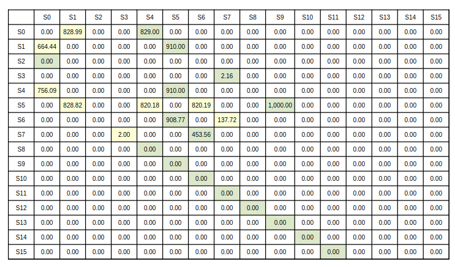
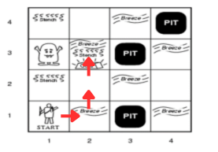

# Wumpus World x Q-Learning

## Introduction

This project applies Q-learning, a reinforcement learning algorithm, to learn an optimal policy for navigating a simplified version of the Wumpus World.

## Wumpus World

We use a reduced version of the Wumpus World where the possible actions are movements (up, down, left, right). The following features are omitted for simplicity:
- **Shooting:** Not implemented, but could be added with custom rewards.
- **Perception of breeze and stench:** Not included in the state representation.

Terminal states are: gold, Wumpus, and pit.

### Reward System

| Square    | Reward   |
|-----------|----------|
| Safe      | +10      |
| Pit       | -10      |
| Wumpus    | -10000   |
| Gold      | +1000    |
| Non valid | 0        |

### State Representation

Each cell `(x, y)` in the grid is mapped to a unique state index:  
`s = x * size + y`

### Wumpus World Instance

<figure>
  
  <figcaption>Wumpus World layout</figcaption>
</figure>

<figure>
  
  <figcaption>Flattened state representation</figcaption>
</figure>

### Reward Table

The reward table is generated by the [`WumpusWorld.create_reward_table()`](WumpusWorld.py) method.  
For each cell, valid adjacent cells (up, down, left, right) are assigned rewards according to the system above.

<figure>
  
  <figcaption>Reward table</figcaption>
</figure>

## Q-Learning

Q-learning is used to solve the Wumpus World problem by learning a Q-table `Q[s, s']` that estimates the expected future rewards for transitioning from state `s` to state `s'`.

### Q-learning Update Rule

```
Q(s, s') ← Q(s, s') + α [R(s, s') + γ max_{s''} Q(s', s'') - Q(s, s')]
```
- `α`: learning rate
- `γ`: discount factor
- `R(s, s')`: reward for moving from `s` to `s'`
- `Q(s, s')`: learned value for transitioning from `s` to `s'`

### Agent Behavior

- Starts at a fixed initial position.
- Uses an ε-greedy policy for exploration.
- Episode ends at a terminal state (pit, Wumpus, or gold).
- The optimal policy is extracted from the Q-table after training.

### Implementation

- [`WumpusWorld`](WumpusWorld.py): Environment and reward table.
- [`QLearningAgent`](QLearning.py): Q-learning logic, training, and policy extraction.
- [`main.py`](main.py): Runs training and prints the learned policy.

#### Hyperparameters

- Learning rate (`α`): 0.1
- Discount factor (`γ`): 0.9
- Exploration rate (`ε`): 0.2
- Number of episodes: 1000

### Results

<figure>
  
  <figcaption>Q-Table, max Q-value for each state is highlighted in green</figcaption>
</figure>

The agent prefers paths that avoid high-penalty states (Wumpus or pits) and favors directions leading to the gold.

Example final policy:
```
{
    0: 1,  1: 5,  2: 1,  3: 7,
    4: 5,  5: 9,  6: 5,  7: 6,
    8: 4,  9: 5, 10: 6, 11: 7,
    12: 13, 13: 9, 14: 13, 15: 11
}
```
Which translates into the following actions: 
```
[→ ↓ ← ↓]
[↓ ↓ → ↓]
[→ ↑ ← ←]
[→ ↑ ← ↑]
```

<figure>
  
  <figcaption>Optimal policy</figcaption>
</figure>

## Usage

### Prerequisites

- Python 3.x
- `numpy` package

### Setup

Install dependencies:
```sh
pip install numpy
```

### Run Training

```sh
python main.py
```

This will print the learned policy mapping each state to its optimal next state.

## File Structure

- [`main.py`](main.py): Entry point for training and evaluation.
- [`WumpusWorld.py`](WumpusWorld.py): Environment and reward table logic.
- [`QLearning.py`](QLearning.py): Q-learning agent implementation.


## References

- Q-learning Algorithm: [Prezi Q-learning Algorithm](https://prezi.com/p/ql-learning-algorithm/)
- Sutton, R. S., & Barto, A. G. (2018). *Reinforcement Learning: An Introduction*.
